# Hospital Management (Odoo 19)

A custom Odoo module built from scratch to learn Odoo development — managing patients, doctors, and appointments.

## 🎯 Purpose
Learning project: building a real Odoo module step-by-step while learning core Odoo concepts (models, views, security, workflows).

## ✅ Progress
- [x] Module scaffold created
- [x] Doctor model
- [x] Patient model
- [x] Appointment model (linked to Patient + Doctor)
- [x] Many2one relationships (Patient/Appointment → Doctor)
- [x] One2many reverse relationships (Doctor/Patient → Appointments)
- [x] Views (list/form) for all models
- [x] Security & access rights
- [x] Menus
- [x] Business logic (status workflow buttons: Confirm, Done, Cancel — with unsaved-record handling)
- [x] Computed fields (appointment_count on Doctor)
- [x] Constraints/validation (prevent doctor double-booking at same date/time)
- [x] Constraints/validation (double-booking prevention, past-date prevention)
- [x] Access Rights per group (Doctor, Receptionist, Admin) with different read/write/create/delete permissions
- [x] Related fields
- [x] Double-booking constraint upgraded with timedelta buffer (1-hour window instead of exact match)
- [x] Controllers — public webpage at /hospital/doctors listing doctors (no login required)
- [x] Controllers — public /hospital/doctors page, login-gated /hospital/patients page
- [x] Theme Development — custom 'Meet Our Doctors' snippet, drag-and-drop, live data from hospital.doctor
- [ ] Appointment scheduling rules (doctor availability, slot limits)

## ⚠️ Known Gaps / To Polish Later
- [x] Field-level restrictions on Appointment form (Doctors can edit patient/doctor/date directly, not just via buttons)
- [ ] Patient Record Rule — Doctors should only see Patients they've had an appointment.
- [ ] Doctor Record Rule (patient-facing) — Patients should only see Doctors they've had/have an appointment with
- [x] Record Rules (Doctors should only see their own patients/appointments, not everyone's)

## 🧩 Models
- **hospital.doctor** — name, specialization, department, contact info
- **hospital.patient** — name, age, gender, medical history, assigned doctor
- **hospital.appointment** — links a patient + doctor, tracks date, severity, status

## 🛠 Tech
- Odoo 19 (source install)
- PostgreSQL

## 📸 Screenshots

**Permissions about which user can see what**
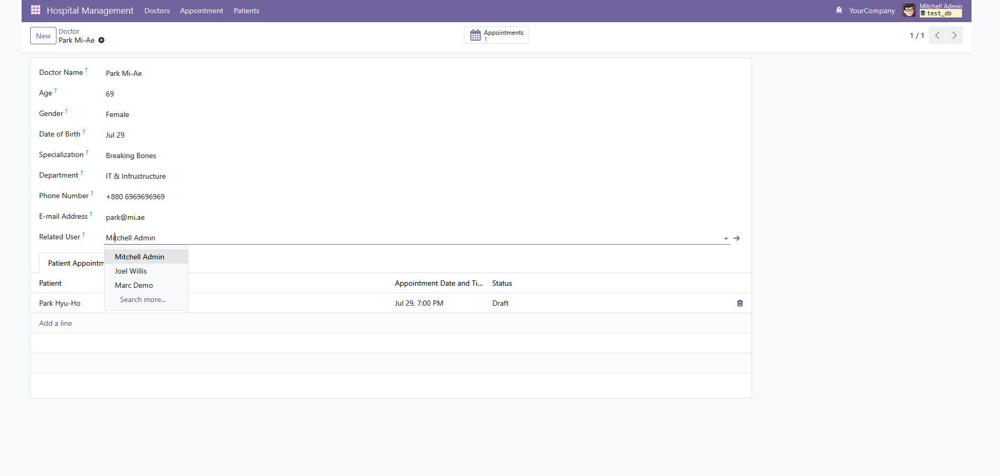

**Doctor Appointment Count Using @api.depends**
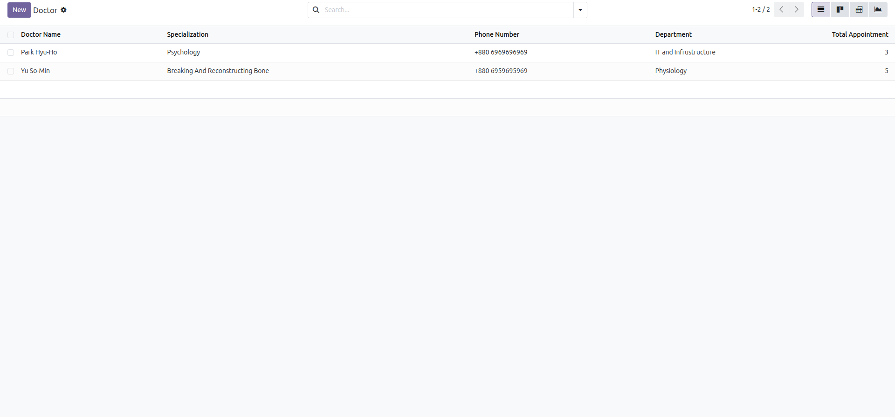

**Kanban View**
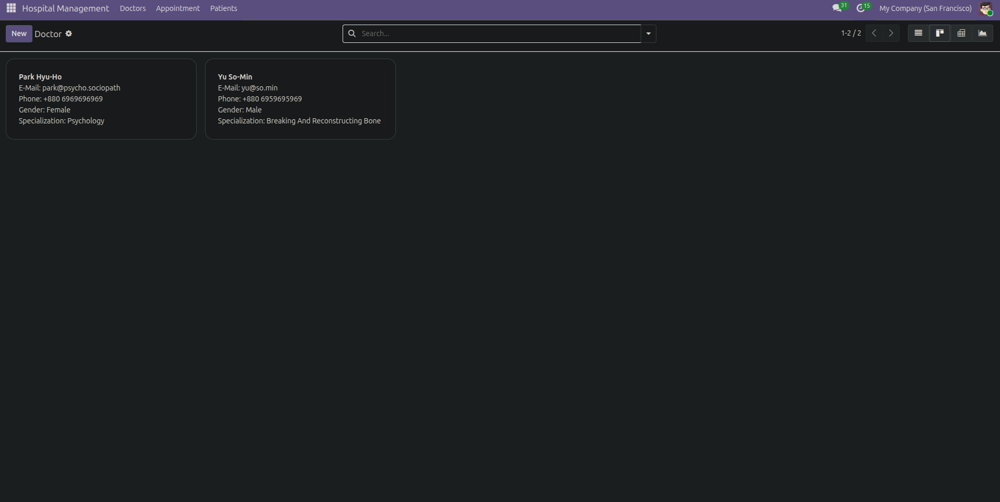

**Search, Filter & Group By**
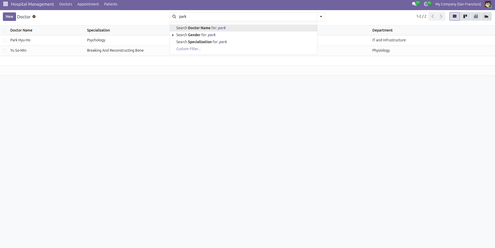
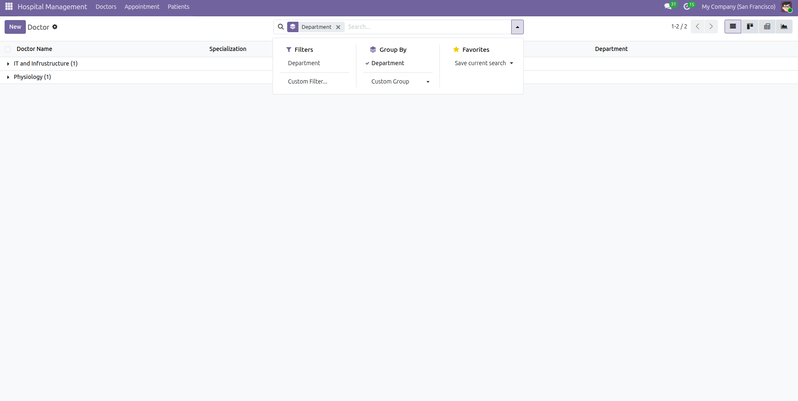

**Doctor List and Form View**

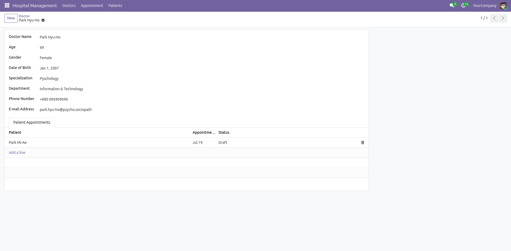

**Patient Form with Linked Appointments and list view**
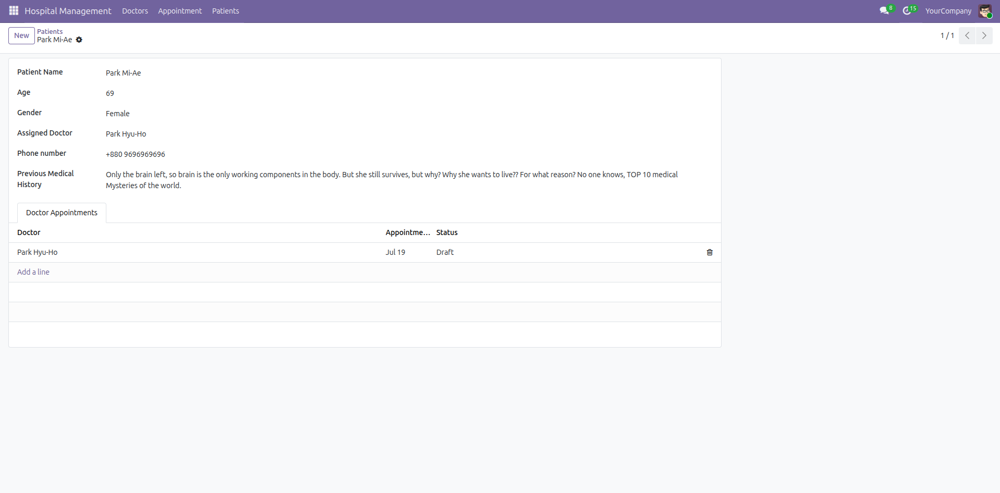
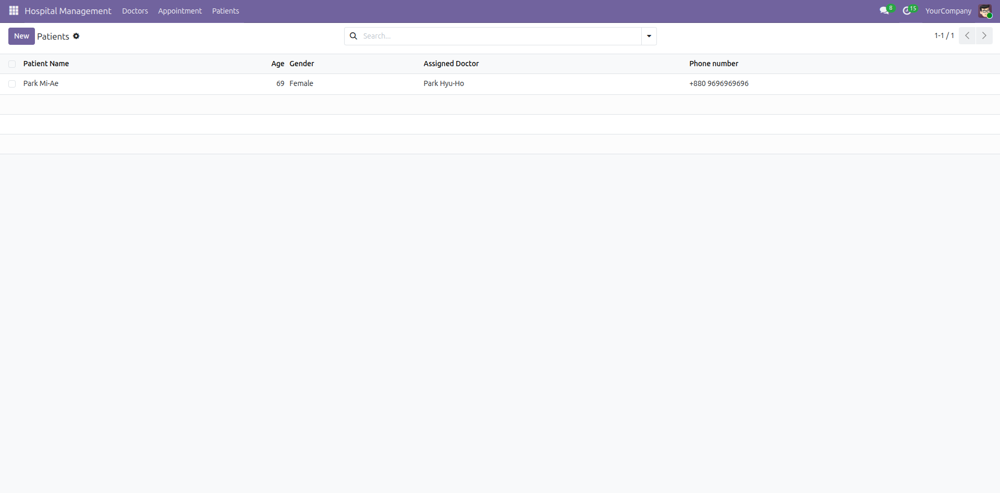

**Appointment Form and List**
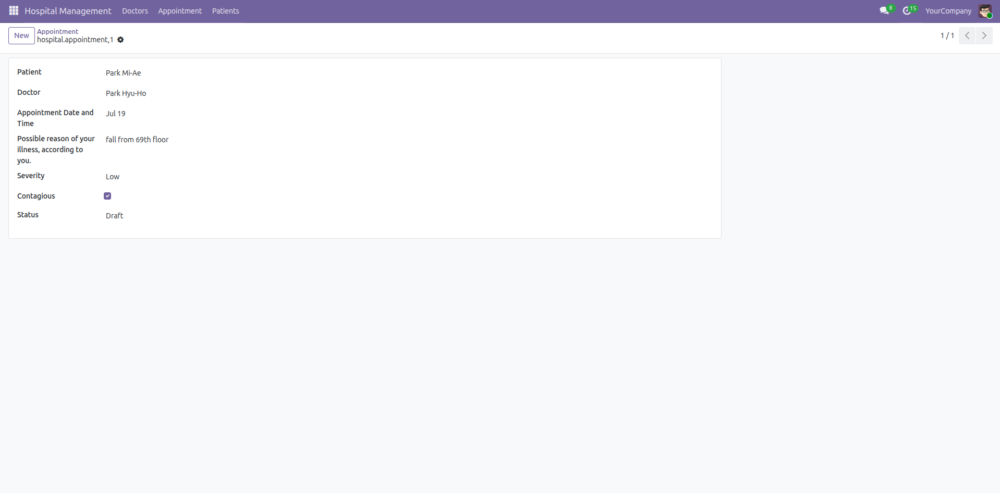
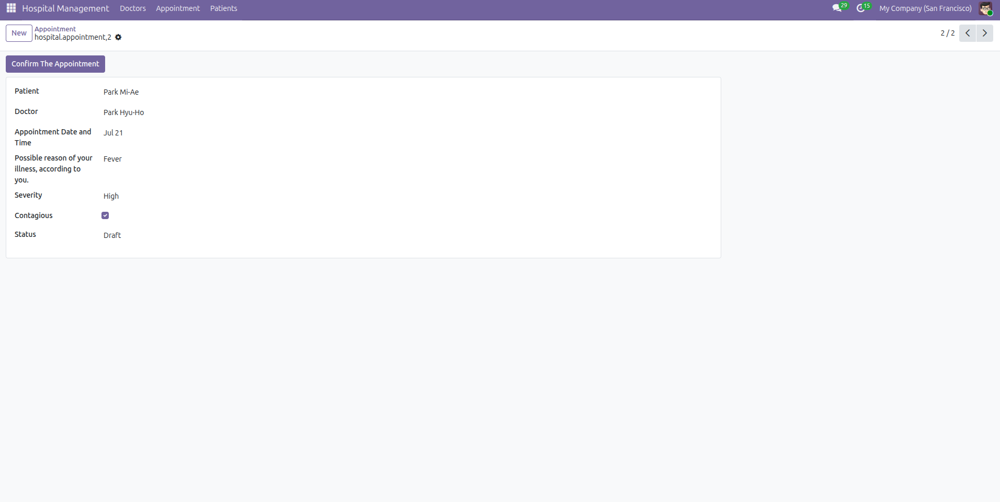
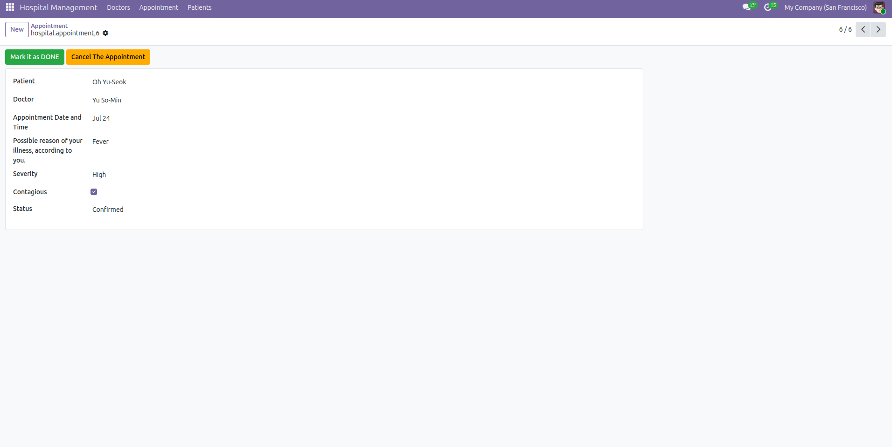
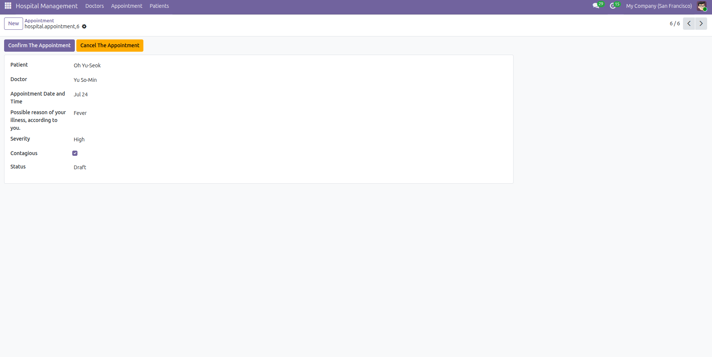
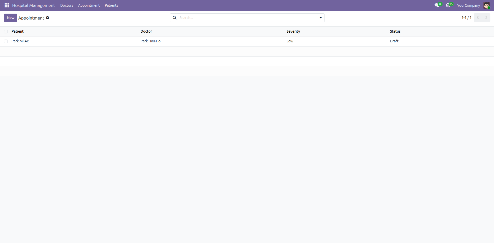